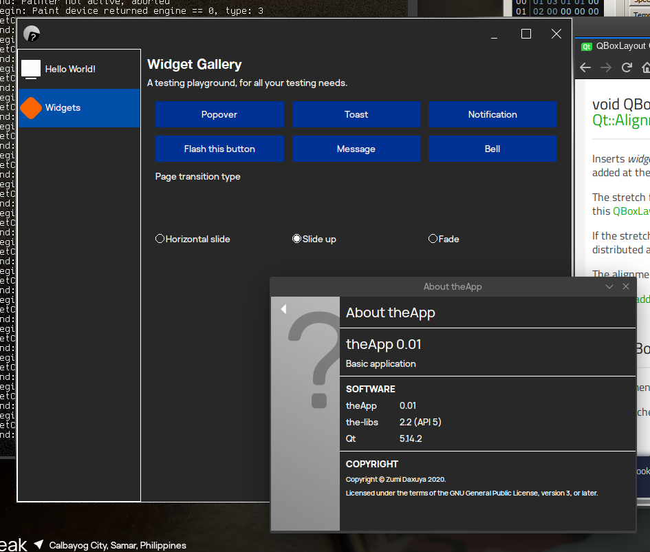

# theApp

An example 3rd-party application for [Victor Tran's theSuite](https://github.com/vicr123).

## Requirements

* Qt 5
* qmake
* [the-libs](https://github.com/vicr123/the-libs)

## Build

`mkdir build && cd build`

`qmake ../theApp.pro && make`

If a build is successful, the application will be in `build/app/theApp`.

## Packaging

Currently an example [PKGBUILD](https://gist.github.com/ZoomTen/2853266b2060d563654cffa9dbcb1d49) is available for Arch Linux and derivatives.
