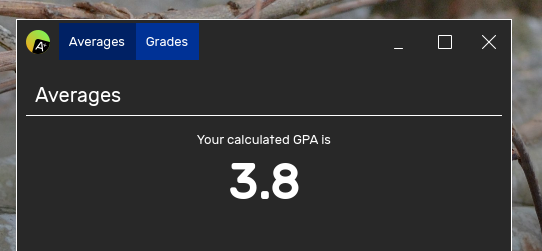
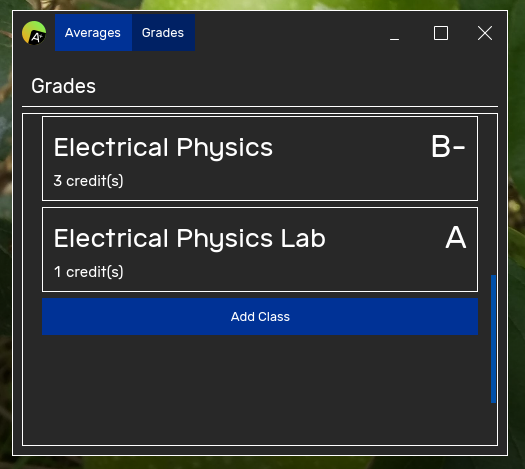
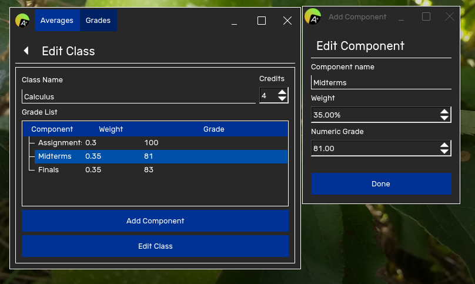

# theGrades

This is a 3rd party app for [Victor Tran's theSuite](https://github.com/vicr123). It is meant to log college/school grades as well as viewing your GPA based on it.

## How

You can set the percent grade-to-letter grade conversion stuff by clicking on the app icon -> Options -> Qualitative Grades.

The percent grade that will be converted to letter grades are the overall grade for a class determined by its grade components.

Keep in mind that the lower bound and upper bound are inclusive, so for an overall class percent grade of 80%, given an A- lower bound of 80.00 and upper bound of 85.00, it will be converted to an A-.

Back to the main app. You can add classes by going to the Grades tab.

Once you add a new class, you will be able to log its individual grade components, that is, what contributes how much to the overall grade score. You can add or delete the components.

Once everything's set up, you will be able to see your calculated GPA in the "Averages" tab.

## Dependencies

* Qt 5
* qmake
* [the-libs](https://github.com/vicr123/the-libs)

## Build

`mkdir build && cd build`

`qmake .. && make`

If a build is successful, the application will be in `build/app/theApp`.